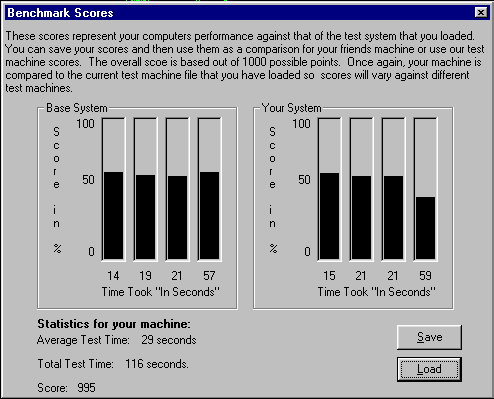



## X\-Bench

### Description

This code applys 4 different filters to 4 different pictures. The pictures are of increasing complexity as are the filters. It then takes all the stats from the time it took the filters to be applied and so on and then benchmarks your computer based on those. It test's the CPU speed, Video Memory and System Memory. There are three different test systems that you can load in to compare your system to and there is also the ability to save your scores and then load them in at a friends house or whatever to compare your scores to theirs. I hope you like the program and if you do throw a vote my way.

Thank's

Element-X Software
 
### More Info
 

             |
---                |---
**Submitted On**   |
**By**             |[Element\-X Software Productions](https://github.com/Planet-Source-Code/PSCIndex/blob/master/ByAuthor/element-x-software-productions.md)
**Level**          |Intermediate
**User Rating**    |5.0 (10 globes from 2 users)
**Compatibility**  |VB 6\.0
**Category**       |[Complete Applications](https://github.com/Planet-Source-Code/PSCIndex/blob/master/ByCategory/complete-applications__1-27.md)
**World**          |[Visual Basic](https://github.com/Planet-Source-Code/PSCIndex/blob/master/ByWorld/visual-basic.md)
**Archive File**   |

### Source Code

PSC wouldn't let me upload it for some reason so here's where to get it: http://www.geocities.com/war_lord15/BenchMark.zip

